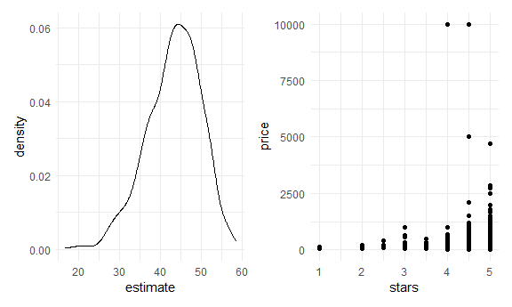

Boostrapping
================

-   Bootstrapping and cross validation are pretty similar. Where you get
    a data set and do repeatedly over and over. Bootstrapping – intends
    to make inference of the parameters / CI. While Cross Validation
    looks at how well this model works on a different dataset.

## Stimulate a dataset

``` r
n_samp = 250

## constant variance data
sim_df_const = 
  tibble(
    x = rnorm(n_samp, 1, 1),
    error = rnorm(n_samp, 0, 1),
    y = 2 + 3 * x + error
  )

## nonconstant variance data

sim_df_nonconst = sim_df_const %>% 
  mutate(
  error = error * .75 * x,
  y = 2 + 3 * x + error
)
```

Make a plot

``` r
sim_df_nonconst %>% 
  ggplot(aes(x = x, y = y)) +
  geom_point()
```


``` r
## this gives good estimates but high standard error
sim_df_nonconst %>% 
  lm(y~x, data = .) %>% 
  broom::tidy()
```

    ## # A tibble: 2 x 5
    ##   term        estimate std.error statistic   p.value
    ##   <chr>          <dbl>     <dbl>     <dbl>     <dbl>
    ## 1 (Intercept)     2.05    0.112       18.4 2.78e- 48
    ## 2 x               2.88    0.0771      37.3 9.23e-104

Implement a procedure so it will gives better standard error

## Let’s try to use the bootstrap for inference

``` r
## Get different regression sample every time you run the code. Draw a sample with replacement and analyze using a linear model. In the end will get the actual distribution of the intercept and the slope 
bootstrap_sample = 
  sim_df_nonconst %>% 
  sample_frac(size = 1, replace = TRUE) %>% 
  arrange(x)

lm(y~x, data = bootstrap_sample)
```

    ## 
    ## Call:
    ## lm(formula = y ~ x, data = bootstrap_sample)
    ## 
    ## Coefficients:
    ## (Intercept)            x  
    ##       2.062        2.864

Let’s write a function..

``` r
boot_sample = function(df){
  
  sample_frac(df, size = 1, replace = TRUE)
}
```

Now, we will make a tibble to keep track of everything.

``` r
boot_strap_df = 
  tibble(
    strap_number = 1:1000,
    strap_sample = rerun(1000, boot_sample(sim_df_nonconst)) ##run this boot_sample function 1000 times 
  )
```

From here … things are kinda the same as “always”

``` r
bootstrap_results = 
  boot_strap_df %>% 
  mutate(
    models = map(.x = strap_sample, ~lm(y~x, data = .x)),
    results = map(models, broom::tidy)
  ) %>% 
  select(strap_number, results) %>%
  unnest(results)

bootstrap_results %>% 
  ggplot(aes(x = estimate)) +
  geom_histogram() +
  facet_grid(~term, scales = "free") 
```

    ## `stat_bin()` using `bins = 30`. Pick better value with `binwidth`.


``` r
## normally distributed plot


lm(y~x, data = sim_df_nonconst) %>% 
  broom::tidy()
```

    ## # A tibble: 2 x 5
    ##   term        estimate std.error statistic   p.value
    ##   <chr>          <dbl>     <dbl>     <dbl>     <dbl>
    ## 1 (Intercept)     2.05    0.112       18.4 2.78e- 48
    ## 2 x               2.88    0.0771      37.3 9.23e-104

``` r
## estimate coefficient would be like under repeatedly sampling, what we think the right ans is.
## mapping standard deviation to a standard error of the sample
## More accurate standard error for the slope.
bootstrap_results %>% 
  group_by(term) %>% 
  summarize(
    se = sd(estimate)
  )
```

    ## # A tibble: 2 x 2
    ##   term            se
    ##   <chr>        <dbl>
    ## 1 (Intercept) 0.0674
    ## 2 x           0.0937

## Use `modelr`

``` r
sim_df_nonconst %>% 
  bootstrap(n = 1000, id = "strap_number") %>% 
  mutate(
    models = map(.x = strap, ~lm(y~x, data = .x)),
    results = map(models, broom::tidy)
  )
```

    ## # A tibble: 1,000 x 4
    ##    strap                strap_number models results         
    ##    <list>               <chr>        <list> <list>          
    ##  1 <resample [250 x 3]> 0001         <lm>   <tibble [2 x 5]>
    ##  2 <resample [250 x 3]> 0002         <lm>   <tibble [2 x 5]>
    ##  3 <resample [250 x 3]> 0003         <lm>   <tibble [2 x 5]>
    ##  4 <resample [250 x 3]> 0004         <lm>   <tibble [2 x 5]>
    ##  5 <resample [250 x 3]> 0005         <lm>   <tibble [2 x 5]>
    ##  6 <resample [250 x 3]> 0006         <lm>   <tibble [2 x 5]>
    ##  7 <resample [250 x 3]> 0007         <lm>   <tibble [2 x 5]>
    ##  8 <resample [250 x 3]> 0008         <lm>   <tibble [2 x 5]>
    ##  9 <resample [250 x 3]> 0009         <lm>   <tibble [2 x 5]>
    ## 10 <resample [250 x 3]> 0010         <lm>   <tibble [2 x 5]>
    ## # ... with 990 more rows

``` r
data("nyc_airbnb")

nyc_airbnb = 
  nyc_airbnb %>% 
  mutate(stars = review_scores_location / 2) %>% 
  rename(
    borough = neighbourhood_group
  ) %>% 
  filter(borough != "Staten Island") %>% 
  select(price, stars, borough, room_type)
```

``` r
nyc_airbnb %>% 
  ggplot(aes(x = stars, y = price)) + 
  geom_point()
```

    ## Warning: Removed 9962 rows containing missing values (geom_point).


``` r
## bootstrapping sample 1000 with replacement of the same sizes --> fit linear model of price against stars for each bootstrap sample --> given all those results map across everything and extract just the coefficients 

airbnb_bootstrap_results = 
  nyc_airbnb %>% 
  filter(borough == "Manhattan") %>% 
  bootstrap(n = 1000, id = "strap_number") %>% 
  mutate(
    models = map(.x = strap, ~ lm(price ~ stars, data = .x)),
    results = map(models, broom::tidy)
  ) %>% 
  select(strap_number, results) %>% 
  unnest(results)

## distribution estimate coefficient of stars
ggp_star_est = 
  airbnb_bootstrap_results %>% 
  filter(term == "stars") %>% 
  ggplot(aes(estimate)) + 
  geom_density()

## not so normally distributed 
## If the sample size is large enough, even though the data is strange, will be able to get some asymptotic distribution 

ggp_scatter = 
  nyc_airbnb %>% 
  filter(borough == "Manhattan") %>% 
  ggplot(aes(x = stars, y = price)) +
  geom_point()

ggp_star_est + ggp_scatter
```

    ## Warning: Removed 4671 rows containing missing values (geom_point).


